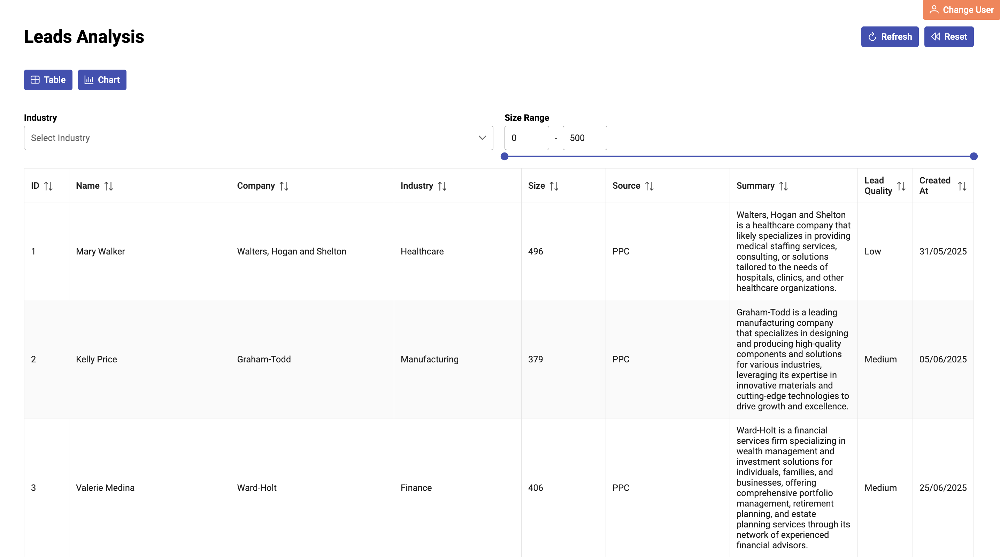

# Leads Management System

A full-stack application to help startup sales teams qualify and analyze demo-request leads with a Python backend and React TypeScript frontend.

### 🔧 Tech Stack
- **Backend:** Python (FastAPI)
- **Frontend:** React with TypeScript (Vite)
- **UI Library:** PrimeReact
- **Database:** PostgreSQL
- **HTTP Client:** Axios
- **Icons:** PrimeIcons
- **Charts:** Chart.js

## Setup Instructions

### Prerequisites
- Python 3.x
- Node.js and npm
- PostgreSQL

### Backend Setup

1. **Create and activate Python virtual environment:**
   ```bash
   python -m venv venv
   source venv/bin/activate
   ```

2. **Select Python interpreter in VS Code:**
   - Press `Cmd+Shift+P` (Command Palette)
   - Type "Python: Select Interpreter"
   - Select the virtual environment interpreter

3. **Install Python dependencies:**
   ```bash
   pip install -r requirements.txt
   ```

### Database Setup

4. **Create PostgreSQL database:**
   ```bash
   createdb {database_name}
   psql  -d {database_name}
   ```
   > Replace `{database_name}` with your database name

5. **Set up database schema:**
   ```bash
   psql {database_name}
   \i db.sql
   \i insert_llm_columns.sql
   \q
   ```

### Frontend Setup

6. **Create React TypeScript frontend:**
   ```bash
   npm create vite@latest frontend -- --template react-ts
   cd frontend
   ```

7. **Install dependencies:**
   ```bash
   npm install
   npm install axios primereact primeicons chart.js
   ```

### Running the Application

**Start Backend:**
```bash
python backend/app.py
```

**Start Frontend:**
```bash
cd frontend
npm run dev
```

## Analytics Queries

### 1. Top 3 filters used in the last 7 days:

```sql
SELECT metadata->>'filter_type' AS filter,
       COUNT(*) AS uses
FROM events
WHERE action = 'filter'
	AND occurred_at >= NOW() - INTERVAL '7 days'
GROUP BY filter
ORDER BY uses DESC
LIMIT 3;
```

**Results:**
| filter     | uses |
|------------|------|
| size_range | 82   |
| industry   | 34   |
| null       | 5    |

### 2. Bar preference overall:

```sql
SELECT metadata->>'view' AS view,
       ROUND(100.0 * COUNT(*) / (SELECT COUNT(*) FROM events WHERE action = 'toggle_view'), 2) AS pct
FROM events
WHERE action = 'toggle_view'
GROUP BY view;
```

**Results:**
| view  | pct   |
|-------|-------|
| chart | 50.00 |
| table | 50.00 |


## 🤖 LLM Integration (Optional)

Use an LLM (llama3.2:3b via ollama) to enrich each lead on fetch:

### Company Summary Generation
- **Prompt:**
  ```
  generate 1 sentence detailed text summary for company according to this data. 
  Just give an answer: company: {company}, industry: {industry}

### Lead Quality Classification
- **Prompt:** 
  ```
  classify lead quality (High/Medium/Low) based on industry and size. 
  Respond with only one word: High, Medium, or Low. 
  size: {size}, industry: {industry}
  ```


### Implementation Details
The LLM integration is implemented using Ollama with the `llama3.2:3b` model in `data/llm_injection.py`. This script processes the leads CSV file and adds two new columns:
- `lead_quality`: AI-generated quality classification
- `summary`: AI-generated company summary

Example enriched payload:
```json
{
  "id": 1,
  "company": "Walters, Hogan and Shelton",
  "industry": "Healthcare",
  "size": "496",
  "lead_quality": "Low",
  "summary": "Walters, Hogan and Shelton is a healthcare company that likely specializes in providing medical staffing services, consulting, or solutions tailored to the needs of hospitals, clinics, and other healthcare organizations."
}
```
### At a Glance

Here's a quick overview of the web app:

- **Data Visualization**: Switch between table and chart views to analyze leads
- **Filtering**: Filter leads by industry, source, company size, and date ranges
- **AI-Enhanced Data**: Each lead includes AI-generated summaries and quality classifications
- **Real-time Analytics**: Track user interactions and view preferences
- **Responsive Design**: Clean, modern interface built with React and PrimeReact


